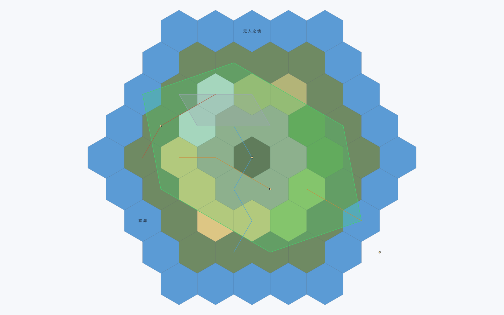

# Project Kaki

**在 Obsidian 里画一张虚构世界的地图。**

[](LICENSE)


Project Kaki（译名 **Project 垣**）是一个 Obsidian 插件：把 `.canvas` 变成一张**可绘制的六边形地图**，
再用 `.base` 把地图和你的世界观笔记连起来 —— 地形、河流、国境、城市都在画布上画，
每个地标又能直接跳到对应的笔记。

> **English** — Project Kaki is an Obsidian plugin for drawing fictional world maps on hex grids
> inside `.canvas` files, and navigating them alongside your worldbuilding notes through `.base`.
> Terrain brushes, rivers/roads/borders, regions, markers and labels; a sidebar panel for common
> actions; SVG export. Requires Obsidian 1.5.0+ (the Base view needs 1.10.0+).
> Docs are in Chinese; see [`docs/USER-MANUAL.md`](docs/USER-MANUAL.md).



*上图的示例世界由插件自己的 SVG 导出渲染器生成（`node scripts/make-preview.mjs` 可重现）——
不是手绘示意图，跑的就是你导出时会走的那条代码路径。*

## 目录

- [特性](#特性) · [安装](#安装) · [快速上手](#快速上手) · [使用说明](#使用说明)
- [Base 视图](#base-视图把地图和笔记连起来) · [导出](#导出) · [设置](#设置)
- [数据与文件](#数据与文件) · [兼容性与已知限制](#兼容性与已知限制) · [常见问题](#常见问题)
- [开发](#开发) · [路线图](#路线图) · [许可证](#许可证) · [签名](#签名)

## 特性

| 能力 | 说明 |
|---|---|
| **六边形地形** | 9 种内置地形（平原 / 森林 / 丘陵 / 山脉 / 水域 / 沼泽 / 沙漠 / 冻原 / 火山），笔刷半径可调，拖动即落笔 |
| **路径** | 河流、道路、贸易路线、边界。河流末端**渐细**，名称**逐字贴着线条**排布 |
| **区域** | 半透明领域范围，名称按面积质心摆放（凹形状也会落在形状内部） |
| **标记与文字** | 地标可绑定笔记链接；文字标注随缩放保持可读字号 |
| **三种几何模式** | 路径与区域可选：**穿内部**（穿格心）/ **沿格边**（勾六边形边框）/ **逐边**（一次点一条边），见下 |
| **撤销 / 重做** | 一次拖动 = 一步历史，可整条笔画撤销、重做 |
| **地图面板** | 右侧边栏视图：常用动作一键触发，不用每次翻命令面板；开发用探针默认隐藏 |
| **Base 视图** | 表格 + 地图缩略图 + 笔记坐标桥：笔记只要写了坐标，就会出现在地图与缩略图上 |
| **SVG 导出** | 一条命令把当前地图导出为独立 SVG 文件 |

## 安装

> ⚠️ 当前**还没有发布 Release**。下面是从源码安装的方式；发布后会补上 Release 与 BRAT 安装说明。

### 从源码构建（开发版）

需要 Node.js 18+。

```bash
git clone https://github.com/Shir0Tak1na/Project_Kaki.git
cd Project_Kaki
npm install --ignore-scripts     # 只装 typescript 与 yaml，没有生命周期脚本
node scripts/build.mjs           # 产出 main.js
```

把 `main.js`、`manifest.json`、`styles.css` **这三个文件**复制到你的库：

```
<你的库>/.obsidian/plugins/project-kaki/
```

然后在 Obsidian 里：设置 → 社区插件 → 打开「已安装插件」→ 启用 **Project Kaki**。

> 只复制这三个文件，**不要**复制 `package.json`（它带 `"type": "module"`，会让 Obsidian 的
> CommonJS 加载混乱）。

## 快速上手

1. 打开（或新建）一个 `.canvas` 文件。
2. `Ctrl/Cmd+P` → **创建地图并绑定到当前 Canvas** → 输入地图名。
   会生成 `Maps/<名字>.map.md`（frontmatter + 一段 JSON 代码块），并自动打开。
3. `Ctrl/Cmd+P` → **启用/停用当前 Canvas 的地图层**（或点左侧边栏的地图图标打开「地图面板」再点一下）。
   画布上出现六边形网格与地形。
4. 按 `D` 进入绘制模式 → `1`–`9` 选地形 → 按住左键拖动。
5. 想把它和笔记连起来：`Ctrl/Cmd+P` → **创建地图 Base 文件（表格视图）** → 打开生成的 `.base` →
   把视图类型切到 **地图**。

## 使用说明

### 快捷键

| 键 | 作用 |
|---|---|
| `D` | 绘制模式 ⇄ 选择模式 |
| `B` / `M` / `T` / `P` / `R` | 工具：地形笔刷 / 标记 / 文字 / 路径 / 区域 |
| `1`–`9` | 切换地形类型 |
| `[` / `]` | 笔刷半径 −1 / +1 |
| `Enter` | 结束正在绘制的路径或区域（比双击更可靠） |
| `Esc` | 取消当前草稿；再按一次退回选择模式 |
| `Ctrl/Cmd+Z` / `Ctrl/Cmd+Shift+Z` | 撤销 / 重做（**仅在绘制模式下接管**；选择模式下交还 Obsidian 的编辑器撤销） |

鼠标：左键绘制或拖动实体；**中键平移**与**滚轮缩放**始终是 Obsidian 原生行为；
双击路径/区域可**重命名**；**右键**删除形状（空白处右键仍弹原生菜单）。

### 三种几何模式

画路径或区域时，工具条上可以切换三种模式 —— 这是为了"看上去更整洁"：

| 模式 | 行为 | 适合 |
|---|---|---|
| **穿内部** | 直线连点，穿过格子内部（默认） | 河流、自然边界等有机形状 |
| **沿格边** | 自动沿六边形边走，勾勒出格边轮廓 | 国境线、行政区、整齐的领地 |
| **逐边** | 每次点击只前进**一条边**，方向由你点的位置决定 | 精细控制每一段走向的工整线条 |

切到沿格边/逐边后，**平滑会被关掉**（平滑会把格边抹成曲线，那就白画了）。
沿格边的路径会比直线距离长约 2 倍（三条边方向相隔 120°，需要"绕"）。

### 地图面板与开发者模式

左侧边栏的地图图标 → 在右侧边栏打开**「地图面板」**，按用途分组列出常用动作
（地图层 / 编辑 / 文件与导出），点按钮就等于执行命令；用不上的按钮显示为灰色，
状态说明在**悬停提示**里。也可以在设置页点「打开面板」。

设置里的 **开发者模式**（默认关闭）控制两个探针命令（诊断当前 Canvas / 监视视口变化）：
关闭时它们从命令面板里**隐藏**（不是灰掉），避免误触。

## Base 视图：把地图和笔记连起来

给任意笔记写上坐标，它就会出现在地图的 Base 视图里：

```yaml
---
coordinates: [320, -140]   # 也接受 {x: 320, y: -140} 或 "320,-140"
map-type: city             # city/town/fortress/ruin/port/temple/mountain-peak/cave/tower
region: 北境王国            # 可选，用于分组
---
```

在 `.base` 里把视图类型选成 **地图**（id 为 `fictional-map`），你会得到：

- 一张**表格**：地图上的标记/路径/区域 + 库里带坐标的笔记，`来源` 列区分「笔记」/「地图」；
- 一个**地图缩略图**：地形色块、路径、区域、标记与笔记点，**都可以点击跳转**到对应文件；
- 坐标写错（例如 `coordinates: 东边那座城`）的行会被**标红**并在表格下方列出问题笔记，
  而不是静默忽略。

视图选项：地图文档 / 坐标属性 / 类型属性 / 地区属性 / 排序方式。
未配置地图文档时，库里只有一张地图会自动选用，多张时只显示笔记侧并给出提示。

## 导出

`Ctrl/Cmd+P` → **导出当前地图为 SVG** → 在**地图文件同目录**生成 `<地图名>.svg`
（重名时自动加后缀，不覆盖已有文件）。

导出与 Base 缩略图**共用同一套世界坐标与配色**，所以导出的图与画布上看到的一致。

## 设置

设置 → 社区插件 → Project Kaki：

| 项 | 默认 | 说明 |
|---|---|---|
| 路径与区域名称的字号 | 1× | 名称随缩放变大但有不小于下限的实际字号；这里整体缩放，右侧直接显示换算后的 CSS 字号 |
| 显示六边形网格 | 开 | 关闭后地形照常绘制，只是不画网格线 |
| 开发者模式 | 关 | 打开后才出现两个诊断用探针命令 |

## 数据与文件

插件只创建两类文件，都是**纯文本、可 Git 管理、可手工编辑**：

- **地图文档** `Maps/<名字>.map.md`：frontmatter 记录绑定关系，正文里一段 fenced JSON 是地图数据；
- **Base 文件**（可选，由命令生成）：YAML。

```yaml
---
type: fictional-cartographer-map     # 地图文档的识别标记（这个值不会改名，见下）
fc-version: 1
name: "World"
canvases:
  - "Maps/World.canvas"
---
```

设计上的承诺：

- **未知字段原样保留**（前向兼容）；`fc-version` 高于插件支持的版本时**只读打开，绝不写回**；
- 地形键按键排序后序列化，**Git diff 稳定**；
- **安全闸**：写入前检查文件里有没有 `type: fictional-cartographer-map`，拒绝覆盖普通笔记；
- 单条目错误只跳过该条目并告警，其余数据保持可用。

> 关于几个"看起来像旧名字"的标识：`fictional-cartographer-map`（地图文档类型）、
> `fictional-map`（Base 视图 id）是**写在你的文件里**的持久化标识，改名会让已有地图与 Base 失效，
> 因此永远保持原样；插件的显示名与目录才是 `Project Kaki` / `project-kaki`。

## 兼容性与已知限制

- **Obsidian 1.5.0+**；**Base 自定义视图需要 1.10.0+**。版本不够时会给出明确提示并
  **降级为仅 Canvas 功能**，不会静默失败。
- 插件内部使用了 Obsidian Canvas 的**未公开 API**（官方没有提供地图/坐标接口）。
  已把它们全部隔离在 `src/canvas/CanvasAdapter.ts`，并对每个字段做**形状守卫**：
  探测失败就优雅停用并提示，而不是抛异常。版本升级后若出现异常，请运行
  **诊断当前 Canvas** 命令并把报告发出来 —— 那是排查版本漂移唯一需要的信息。
- **桌面向**：手势假设鼠标（双击、右键、中键），移动端尚未适配。
- Base 表格一次性建表，**未做虚拟滚动**（几百行会变慢）。
- 撤销栈上限 100 步，**不支持跨文件撤销**。

## 常见问题

**网格和卡片对不齐 / 放大后发糊？**
网格与原生卡片处于同一世界坐标系。若对不齐，先运行 **诊断当前 Canvas**：它会报告挂载点判定、
矩阵缩放、坐标量化粒度与实测标定结果。

**名称太小 / 太大？**
设置里调「路径与区域名称的字号」。名称承诺的是 **CSS 像素**，且随画布缩放变化；
设置页会显示换算后的实际字号，便于直接读数。

**为什么地形画在卡片下面？**
绘制顺序 = 命中测试顺序。地形需要在卡片之下，覆盖层就必须插在宿主最前面，
因此它**永久不参与指针事件**；绘制手势在视图容器上以捕获阶段监听，并排除原生控件。

**在旧版 Obsidian 上会怎样？**
1.10.0 以下只注册 Canvas 功能并给出提示；1.5.0 以下不做任何事。不会报错。

## 开发

```bash
node scripts/build.mjs                            # 构建（自研：TypeScript 编译器 API + 模块内联 → main.js）
node node_modules/typescript/bin/tsc --noEmit     # 类型检查（0 错是底线）
node --test --test-isolation=none                 # 176 个单元测试
node scripts/smoke.mjs                            # 冒烟：加载真实 main.js + 假 Obsidian，22 个场景 / 401 条断言
node scripts/deploy.mjs                           # 部署到隔离测试库（默认 E:\ObsidianPulgins\test-vault）
```

**提交或发布前请按顺序跑完前四条命令。** 冒烟测试加载的是打包产物 `main.js`，
不重新构建就会拿旧产物跑测试。

```
src/          插件源码（core 纯函数 · canvas 私有 API 隔离层 · render 绘制 · editor 交互 · base Base 视图 · ui）
tests/        单元测试（node:test，纯函数优先）
scripts/      build / smoke / deploy / make-preview
docs/         用户手册 · 工程笔记 · 技术方案 · 各阶段实施记录
```

想深入的话，按这个顺序读：

1. [`docs/USER-MANUAL.md`](docs/USER-MANUAL.md) — 面向使用者的完整手册（含故障排查）；
2. [`docs/ENGINEERING-NOTES.md`](docs/ENGINEERING-NOTES.md) — **接手必读**：踩过的坑、测试策略、
   未验证项。其中 §5「已经踩过的坑」是这个项目最贵的东西；
3. [`docs/HANDOFF.md`](docs/HANDOFF.md) — 当前基线与下一步；
4. [`docs/TECHNICAL-DESIGN-v2.md`](docs/TECHNICAL-DESIGN-v2.md)、
   [`docs/PHASE-0-RESULTS.md`](docs/PHASE-0-RESULTS.md) — 设计推导与平台实测数据。

## 路线图

- **Phase 3 验收**：Base 缩略图点击跳转、极端容器比例下的等比例显示（已在真实库确认可见，交互待逐项复核）；
- **样式与图层**：自定义字体族、路径/区域颜色面板、图层开关（地形/路径/区域/标记）、图例；
- **Phase 4**：PNG 导出（SVG 已完成）；
- **Phase 5**：自定义地形图标与图块；
- **Phase 6**：移动端与触控笔（长按代替右键、单指绘制、双指平移缩放）。

## 许可证

[Apache License 2.0](LICENSE)。

## 签名

这个插件是一个人跟一个 AI 结对做出来的，两边都签在这里。

**Shir0Tak1na** —— 设计者、出题人、验收人。提出「在 Canvas 里画虚构地图」这个想法，
做全部产品与设计决策，在真实库里一轮一轮试手感、报缺陷。这个项目每一个转折点都来自他的反馈：
提出给区域与线条命名、指出「名称没有办法顺着路自动适应」、指出「河流绘制过后直接变为了折线段」，
以及那句直接点破根因的「调整滑块，字体只有阴影在变化」——`ctx.font` 里的 `var()` 让整条字体声明
非法、被浏览器静默忽略，我自己推导了两轮都没找到。他还定义了这个项目的节奏：小步交付、
每一步都要能亲眼验证、错了就说错。

**DeepSeek Harness Agent** · `deepseek-v4-flash-vision-exp` —— 写代码、写测试、写文档。
账也记在文档里，不藏：三次"数值改对了但机制没生效"、两次把断言写在实现细节上
（所以"河流变折线"这种东西能全绿通过）、一次忘了触发异步加载（界面无报错但数据永远是 0）。
这个项目里可靠的部分都是**量出来**的，不是猜的 —— 坐标换算、量化误差、位图与 CSS 像素的比例、
字号的实际大小，全部以实测为准。

```
Shir0Tak1na                                          2026-09-23
DeepSeek Harness Agent · deepseek-v4-flash-vision-exp  2026-09-23
```
